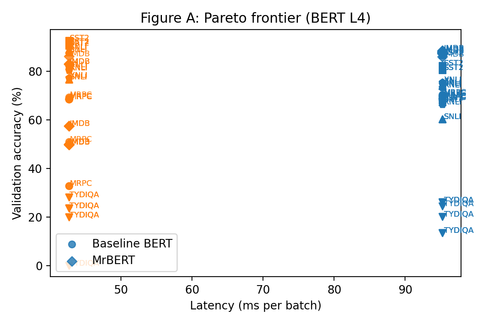
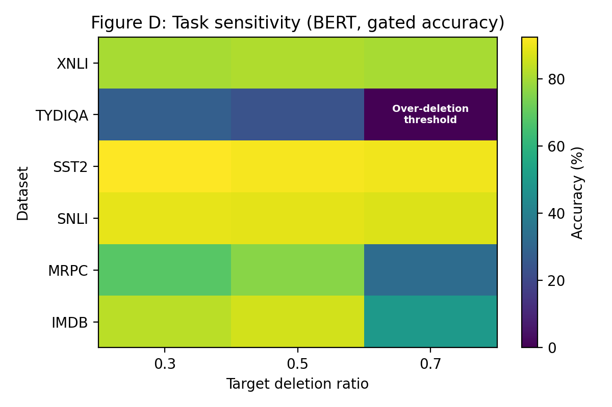
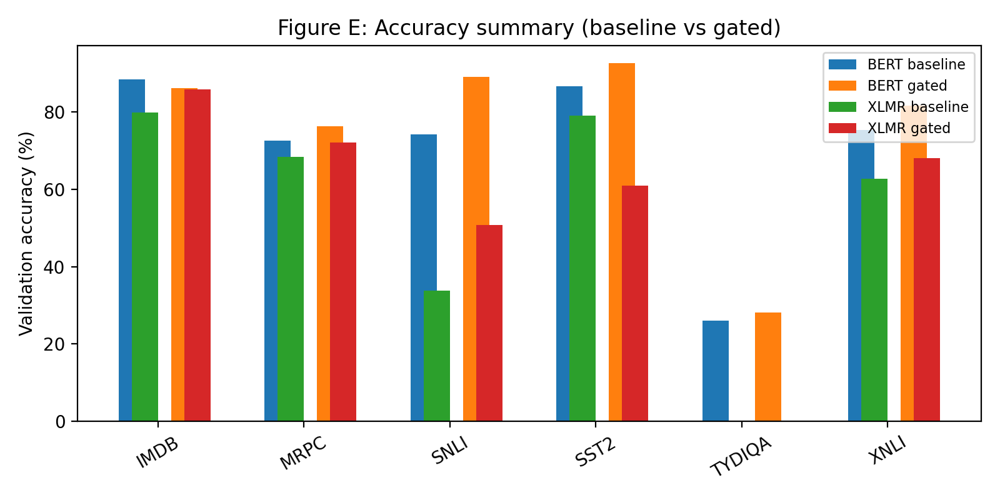
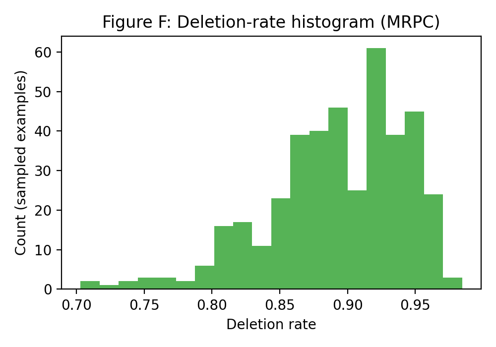
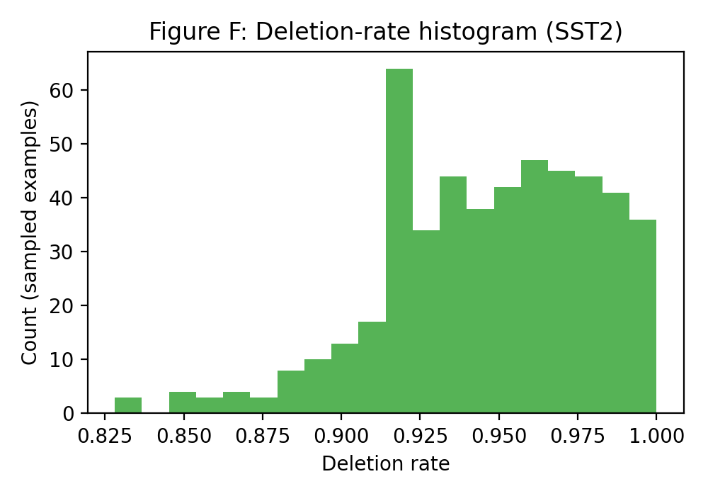
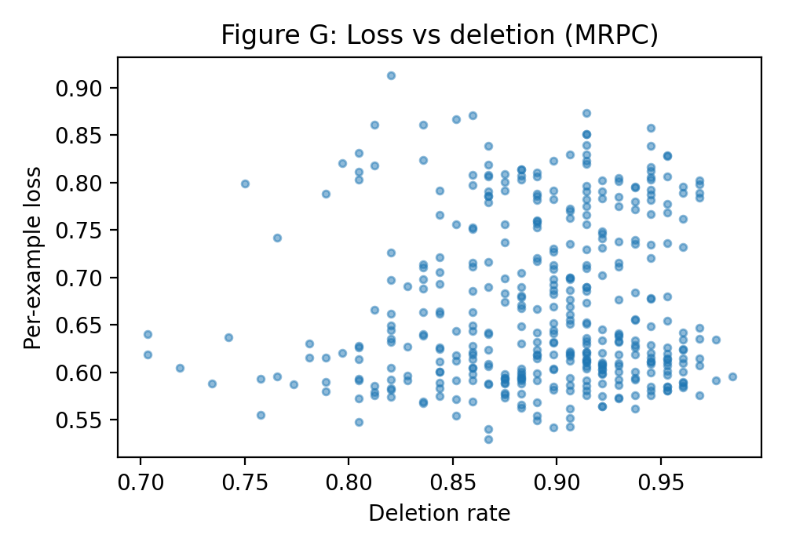
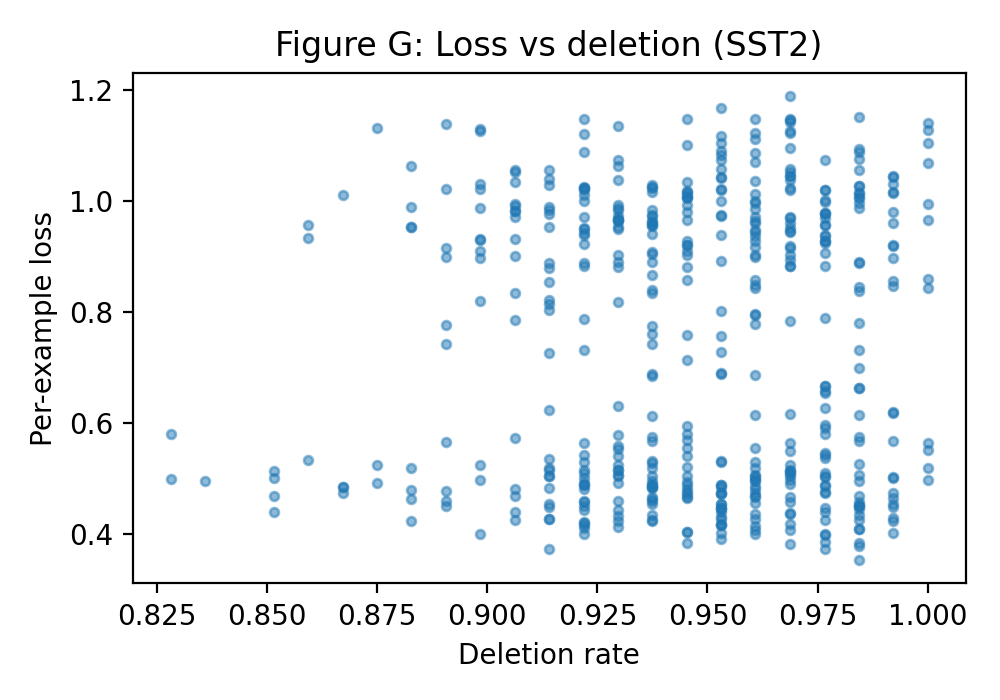
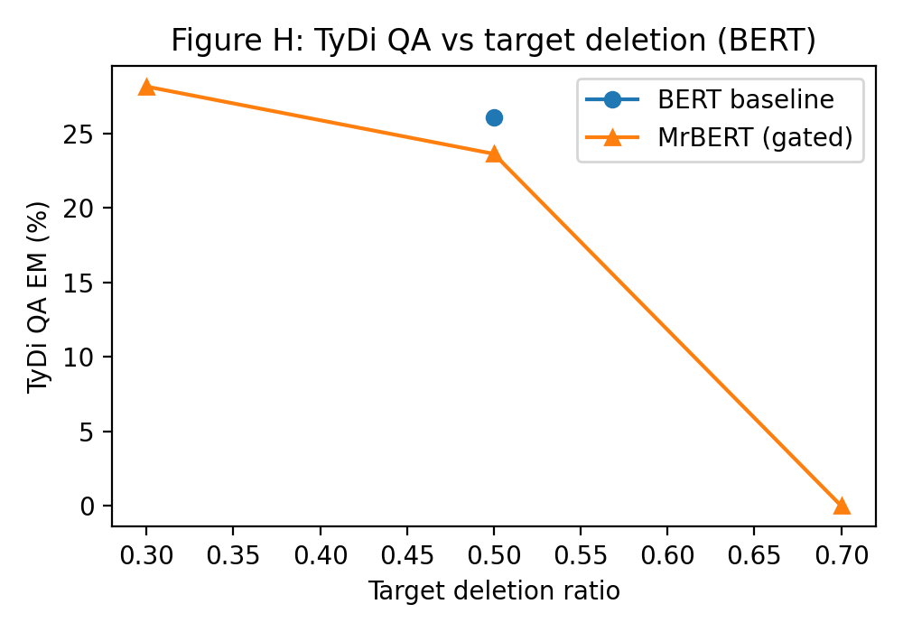
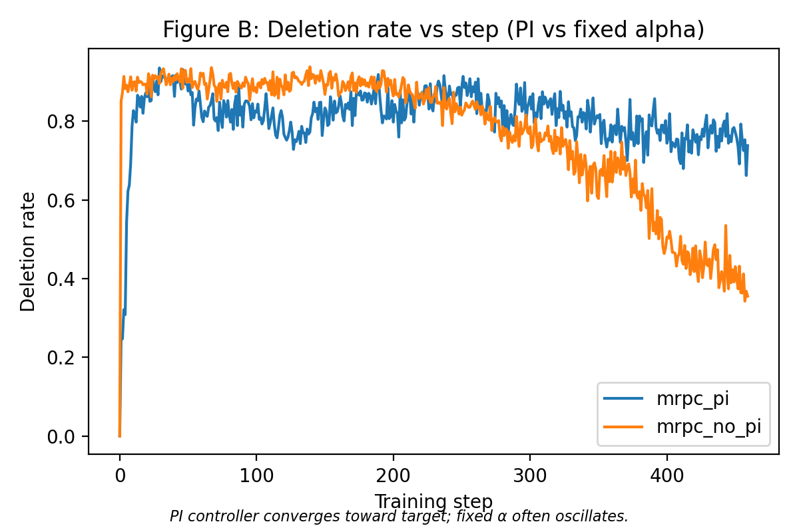

## Title and Key Information

**Title**: MrBERT and MrXLM: Dynamic Token Merging for Efficient Classification and QA  
**Team members**:
**Project type**: Custom project  
**TA mentor**: \[TA name\]  
**External collaborators / mentors**: None  
**Shared with other course**: No  

---

## Abstract

Subword-based Transformer encoders like BERT and XLM-R are inefficient on long sequences because they process every token at every layer, even when many tokens are redundant. Inspired by MrT5, we add a lightweight **delete gate** to BERT and XLM-R (MrBERT, MrXLM) that learns which tokens to keep, enabling **dynamic token merging**. During training we use a soft, differentiable deletion mechanism inside self-attention; at inference we apply hard deletion to physically shorten sequences and save computation. On English classification tasks (MRPC, SST-2, SNLI, XNLI) MrBERT consistently matches or improves validation accuracy over BERT while deleting 50–75% of tokens. On long-document sentiment (IMDB) and cross-lingual QA (TyDi QA), aggressive deletion can hurt performance, revealing task-dependent sensitivity to token pruning. For XLM-R, a straightforward adaptation (MrXLM) works well on MRPC but is much less robust on SST-2, SNLI, IMDB, and XNLI, motivating several architectural and controller tweaks. A GPU latency benchmark on a single T4 shows that hard deletion yields up to **30–55%** inference speedup at fixed batch size. We further perform a **per-example loss–deletion analysis** and error case study on SNLI and TyDi QA, showing that higher deletion often correlates with higher loss on difficult examples and that over-deletion can remove answer-bearing tokens. Overall, our results suggest that dynamic token merging is a promising direction for encoder efficiency, but requires careful control (e.g., PI controller, gate placement) and task-aware tuning.

---

## 1 Introduction

Transformer encoders such as BERT and XLM-R are the backbone of many modern NLP systems, but they remain computationally expensive. For a sequence of \(n\) tokens and \(L\) layers, a standard encoder performs \(O(L n^2)\) attention operations: every token attends to every other token at every layer. In practice, many tokens (e.g., stopwords, punctuation, subwords inside multi-token words) contribute little to downstream predictions, especially after the model has already integrated local context in earlier layers. This suggests a natural question: **can we learn to drop tokens dynamically, without sacrificing too much accuracy?**

Recent work on encoder–decoder models has shown that dynamic token merging can yield substantial efficiency gains. MrT5 introduces a **delete gate** that scores tokens after a fixed layer, then uses those scores to stochastically drop tokens while preserving task performance. However, MrT5 focuses on T5-style encoder–decoder models, and does not explore pure encoders like BERT or multilingual encoders like XLM-R that are widely used for classification and extractive QA.

In this project we adapt the MrT5 delete gate to **encoder-only models**, building **MrBERT** and **MrXLM**. Our goal is two-fold:

- **Efficiency**: Achieve real wall-clock speedups by shortening sequences via hard deletion at inference time.  
- **Accuracy**: Maintain or improve task performance, ideally acting as a useful inductive bias or regularizer.

Our main contributions are:

- We implement MrBERT for English classification (MRPC, SST-2, SNLI, IMDB, XNLI) and TyDi QA, with a delete gate after encoder layer 3, soft deletion during training, and hard deletion at inference.  
- We integrate a **PI controller** that automatically adjusts the gate regularization weight to track a target deletion ratio; we show that this controller stabilizes deletion compared to a fixed gate weight.  
- We extend the design to **XLM-R** (MrXLM) and analyze why the same gate settings that work well for BERT are too aggressive for XLM-R, proposing several rescue strategies (later gate layer, slower PI warmup, higher gate threshold).  
- We provide a detailed **results analysis** across all runs, including a Pareto frontier of accuracy vs latency (Figure A), task sensitivity heatmap (Figure D), per-example loss vs deletion correlations (Figure G), deletion histograms (Figure F), TyDi QA sensitivity curve (Figure H), and PI vs fixed-\(\alpha\) deletion-rate traces (Figure B).

---

## 2 Related Work

**Efficient Transformers.** A large line of work reduces the quadratic cost of self-attention through sparsity (e.g., Longformer, BigBird), low-rank approximations (Linformer), or kernelization (Performer). These approaches redesign the attention pattern or computation, but generally keep the token sequence length fixed. In contrast, dynamic token merging reduces **sequence length** by dropping tokens.

**Dynamic token pruning and merging.** MrT5 introduces a delete gate for encoder–decoder models, learning which tokens to drop after a certain layer while preserving task quality. Other methods prune tokens based on attention scores or learned importance weights, often using reinforcement learning or auxiliary losses. Our work is closest to MrT5 but focuses on encoder-only BERT/XLM-R, which have different pooling mechanisms (e.g. `[CLS]` for BERT) and are deployed on different tasks (sentence-pair classification, long-document sentiment, extractive QA, cross-lingual NLI).

**Adaptive computation and early exiting.** Approaches such as DeeBERT and PABEE allow encoders to exit early in depth depending on confidence. While these methods reduce the number of layers executed, they again do not change the sequence length. Our method is complementary: we keep the number of layers fixed but reduce the number of tokens processed in later layers.

**Subword regularization and robustness.** Prior work on subword regularization (e.g., BPE-dropout) and data augmentation shows that random or learned perturbations at the subword level can improve robustness. Our delete gate can be viewed as a structured, learned perturbation that removes low-utility subwords, potentially acting as a regularizer on classification tasks.

Our project differs from these lines primarily by (1) applying dynamic token merging to encoder-only BERT and XLM-R, (2) exploring a PI controller for deletion-rate control in this setting, and (3) performing a detailed multi-task analysis (including cross-lingual QA) of when such merging helps or hurts.

---

## 3 Approach

### 3.1 Delete gate and soft vs hard deletion

We follow the MrT5 design and insert a **delete gate** after encoder layer \(l\) (default \(l=3\)). Let \(H_l \in \mathbb{R}^{n \times d}\) be the hidden states at layer \(l\). The gate computes one scalar score per token:
\[
G = k \cdot \sigma(\mathrm{LayerNorm}(H_l)W + b),
\]
where \(k=-30\), \(W \in \mathbb{R}^{d \times 1}\), and \(\sigma\) is a sigmoid. This adds only \(2d + 1\) parameters and outputs gate scores \(G_i \in [k,0]\). Intuitively, more negative scores indicate tokens that should be deleted.

We distinguish **soft deletion** (training) and **hard deletion** (inference):

- **Soft deletion (training).** The sequence length remains fixed. For each subsequent layer, we add gate scores to the attention logits:
  \[
  \mathrm{scores} = \frac{QK^\top}{\sqrt{d}} + \mathrm{mask} + \mathbf{1}G^\top.
  \]
  Tokens with strongly negative gate scores receive much less attention, but gradients still propagate through all tokens.
- **Hard deletion (inference).** We convert gate scores into a binary keep mask. Tokens with \(G_i > k \cdot \text{gate\_threshold\_ratio}\) (default threshold ratio 0.5) are kept; others are dropped. We build an index tensor `keep_indices` and gather hidden states into a shorter sequence, then run the remaining layers and task head only on kept tokens. We always force-keep `[CLS]` in BERT and the first token in XLM-R.

In code, `MrBertModel` and `MrXLMRobertaModel` expose a `use_soft_deletion` flag; training uses `use_soft_deletion=True`, and evaluation uses hard deletion by default.

### 3.2 Loss and PI controller

We train with a joint loss
\[
L = L_{\text{task}} + \alpha L_G,
\]
where \(L_{\text{task}}\) is cross-entropy for classification or span prediction, and
\[
L_G = \frac{1}{N}\sum_i G_i
\]
encourages more negative gate scores (higher deletion). The scalar \(\alpha\) controls the strength of deletion pressure.

We support two regimes:

- **Fixed \(\alpha\).** We set `gate_weight` manually (e.g. \(1\times10^{-4}\)).  
- **PI controller.** We maintain a target deletion ratio \(\tau\) (e.g. 0.3 or 0.5). At each step we estimate the current deletion ratio (fraction of tokens below threshold) and compute an error \(e_t = \tau - r_t\). The PI controller updates
  \[
  \alpha_t = \max(0, k_p p_t + k_i i_t),
  \]
  where \(p_t\) is an exponentially smoothed error and \(i_t\) is the cumulative sum of errors. We use defaults \(k_p = 0.5\), \(k_i = 10^{-5}\) for BERT, and expose these as `--controller_kp` and `--controller_ki`. This mechanism automatically increases \(\alpha\) when deletion is too low and decreases it when deletion overshoots.

Figure B (deletion rate vs step) compares deletion trajectories for PI vs fixed \(\alpha\) on MRPC, showing that PI produces a smoother convergence toward the target deletion, whereas fixed \(\alpha\) can oscillate.

### 3.3 BERT and XLM-R task heads

We wrap our gated encoders with standard task heads:

- **MrBertForSequenceClassification / MrXLMRobertaForSequenceClassification**: `[CLS]` (or first token) pooling followed by dropout and a linear classifier. Used for MRPC, IMDB, SST-2, SNLI, XNLI.  
- **MrBertForQuestionAnswering / MrXLMRobertaForQuestionAnswering**: span head predicting start and end logits over tokens. Used for TyDi QA.

For QA we also propagate `keep_indices` and `kept_lengths` through the hard-deletion path and remap predicted start/end indices from the shortened sequence back to original token indices; this is essential for TyDi QA EM to be meaningful.

### 3.4 XLM-R-specific design and rescue strategies

Directly porting the BERT gate design to XLM-R leads to strong degradation on several tasks, even when deletion rates are moderate. We investigated several **rescue strategies** for MrXLM, implemented via new command-line flags:

1. **Gate layer placement (`--gate_layer_index`).** Placing the gate at a later layer (e.g., 6 instead of 3) can improve stability by allowing more layers to build high-level multilingual representations before deletion.  
2. **Controller gains and warmup (`--controller_kp`, `--controller_ki`, `--gate_warmup_steps`).** We found that XLM-R often requires **slower PI warmup** and longer gate warmup (e.g., 3000 steps) to avoid over-deletion early in training.  
3. **Gate threshold ratio (`--gate_threshold_ratio`).** Increasing the threshold ratio (e.g., 0.6–0.7) makes hard deletion less aggressive for XLM-R; we expose this flag and propagate it through the config and model constructors.

These modifications are reflected in the XLM-R runs in `results/new/xlmr_from_A100/` and summarized in Section 5.

### 3.5 Implementation highlights and design choices

Here we briefly describe several concrete implementation decisions, what problems they were solving, and why we chose our current design:

- **Soft vs hard deletion (`use_soft_deletion`).**  
  - **Problem.** Directly hard-deleting tokens during training makes the model non-differentiable with respect to deletion decisions and can lead to unstable training.  
  - **Design.** We added a `use_soft_deletion` flag in all gated encoders (MrBERT, MrXLM, MrRoberta) and defaulted it to `self.training` in `forward`. Training always uses **soft deletion** (gate as attention bias; full-length sequence), while evaluation uses **hard deletion** (shortened sequence). This clean separation lets us optimize with stable gradients while still realizing real latency gains at inference.

- **QA span remapping with `keep_indices` / `kept_lengths` (deletion map).**  
  - **Problem.** In TyDi QA (and any span-based head), hard deletion shortens the sequence. The span head predicts `(start_short, end_short)` in this **short** sequence; without a deletion map, these indices no longer align with the original context, so EM would be computed in the wrong coordinate system.  
  - **Design.** In the hard-deletion path of `MrBertModel` / `MrXLMRobertaModel`, we:  
    1. Compute a binary keep mask `keep_masks = (gate > gate_k * gate_threshold_ratio)` (and always keep `[CLS]` / first token).  
    2. For each batch element \(b\), collect original indices of kept tokens into `keep_indices[b, j]` and their counts into `kept_lengths[b]`.  
    3. Use `torch.gather` with `keep_indices` to build a shorter hidden-state tensor `(batch, max_kept, hidden_size)` for the remaining layers and heads.  
    4. In `train_mrbert.py` and `scripts/extract_error_cases.py`, map predicted `(start_short, end_short)` back to original indices via `keep_indices.gather(...)` before computing EM.  
  This explicit deletion map is what makes it safe to combine hard deletion with span-level evaluation.

- **Gate warmup and two-phase schedule.**  
  - **Problem.** When we turned on the gate from step 0, the model sometimes collapsed early: deletion spiked before the classifier/QA head learned a reasonable decision boundary.  
  - **Design.** In `train_mrbert.py` we added `--gate_warmup_steps` and an optional Phase A (`--phase1_steps`, `--phase1_gate_weight`). During warmup we set \(\alpha = 0\) so the model learns on full sequences; Phase A uses a lighter gate weight to gently adapt deletion; Phase B uses the full gate/PI strength. This schedule stabilizes training, especially for TyDi QA and XLM-R.

- **PI controller and deletion-rate logging.**  
  - **Problem.** A fixed gate weight \(\alpha\) can lead to oscillatory or unstable deletion rates across steps, and makes it hard to compare runs at a given target deletion.  
  - **Design.** We implemented `mrbert/pi_controller.py` and wired it into `train_mrbert.py` with `--use_pi`, `--controller_kp`, and `--controller_ki`. We also added a lightweight `--log_deletion_trace` option that records per-step deletion rates into JSONL files. These traces underpin Figure B and allow us to empirically validate that PI tracks the target deletion more smoothly than a fixed \(\alpha\).

- **Gate placement and XLM-R rescue flags.**  
  - **Problem.** XLM-R was much more brittle than BERT under the same gate settings: the gate at layer 3 with threshold ratio 0.5 and default PI gains over-deleted on SST-2/SNLI/XNLI.  
  - **Design.** Rather than hard-coding these hyperparameters, we exposed them as CLI flags (`--gate_layer_index`, `--gate_threshold_ratio`, `--controller_kp`, `--controller_ki`, `--gate_warmup_steps`) and threaded them through `run_experiments.sh` and `run_xlmr_modal.py`. This made it easy to test late-gate, higher-threshold, and slower-PI configurations that partially recover XLM-R performance (as summarized in Section 5 and Figure D/H).

- **Loss–deletion correlation and error-case pipeline.**  
  - **Problem.** We initially had only aggregate deletion and accuracy numbers, which made it hard to answer per-example questions such as “does deleting more on this example make it worse?” or to systematically study high-deletion failures.  
  - **Design.** We built a small analysis pipeline: `analyze_loss_vs_deletion` computes per-example loss and deletion rate and writes `loss_vs_deletion_<dataset>.json` (with Pearson/Spearman and `scatter_sample`), and `scripts/extract_error_cases.py` filters misclassified high-deletion examples into `error_cases_*.jsonl`. These files power Figure F/G and the error analysis in Section 5.2.

- **Latency benchmark and Pareto plotting.**  
  - **Problem.** Measuring training speed alone does not capture inference-time benefits, and raw latency numbers are hard to interpret across models and tasks.  
  - **Design.** We implemented `latency_benchmark.py` to run multiple forward passes for baseline BERT and MrBERT under identical batch/sequence settings and wrote `latency_results.json`. The plotting script `scripts/plot_mrbert_figures.py` then aggregates these with `train_results.jsonl` to produce Figure A (Pareto frontier) and Figure E (accuracy summary), making the accuracy–efficiency trade-offs visually clear.

Overall, these implementation choices were driven by concrete failure modes we observed (non-differentiable deletion, broken QA spans, unstable deletion rates, brittle XLM-R, limited per-example insight) and were iterated on until the behavior matched the design goals of stable training, meaningful deletion-rate control, and fair cross-model comparisons.

---

## 4 Experiments

### 4.1 Datasets and evaluation

We evaluate on:

- **MRPC (GLUE)**: binary paraphrase detection; metric: validation accuracy.  
- **IMDB**: binary long-document sentiment; metric: validation accuracy.  
- **SST-2 (GLUE)**: single-sentence sentiment; metric: validation accuracy.  
- **SNLI**: three-way natural language inference; metric: validation accuracy.  
- **XNLI**: multilingual NLI; for MrXLM we use XNLI; metric: validation accuracy.  
- **TyDi QA (secondary task)**: extractive QA; metric: Exact Match (EM).

We use HuggingFace datasets with standard splits and preprocess text using the corresponding BERT or XLM-R tokenizer. For classification tasks we truncate and pad sequences to length 128; for TyDi QA and XNLI we use 256 tokens.

### 4.2 Training setup

- **Backbones.** `bert-base-uncased` and `xlm-roberta-base`.  
- **Optimization.** AdamW, learning rate \(2\times 10^{-5}\), batch sizes 8 or 24 depending on run, one or more epochs as specified in the results.  
- **Deletion settings.** We sweep target deletion ratios 0.3, 0.5, 0.7 for BERT; for XLM-R we focus on 0.3 and 0.5. Gate warmup is typically 1000–1500 steps for BERT, and up to 3000 steps for XLM-R rescue runs.  
- **Hardware.** BERT runs are executed on a single NVIDIA L4 GPU; XLM-R runs on a Modal A100 volume (see `xlmr_from_A100` folders). Latency is measured on a T4 using a dedicated benchmark script with batch size 16 and sequence length 256.

Implementation details, including data loading, model configuration, and logging, follow the code described in `train_mrbert.py` and `run_experiments.sh`.

### 4.3 Main quantitative results (BERT)

Figure E (accuracy summary) and Section 1 of `RESULTS_ANALYSIS.md` summarize BERT results across target deletions. We highlight representative findings:

- **Balanced run (target 0.3, warmup 1000).**  
  - MRPC: baseline 68.38% → MrBERT 68.63% (actual deletion ~54%).  
  - SST-2: baseline 67.89% → MrBERT 92.55% (actual deletion ~62%).  
  - SNLI: baseline 74.00% → MrBERT 89.02% (actual deletion ~76%).  
  - XNLI: baseline 74.82% → MrBERT 80.56% (actual deletion ~65%).  
  - TyDi QA: baseline 20.18% → MrBERT 28.16% EM (actual deletion ~11%).  
  This configuration gives the **best overall trade-off** between accuracy and deletion across tasks.

- **Higher target 0.5 (warmup 1000).**  
  - SNLI, SST-2, and XNLI continue to improve over baselines at similar or higher deletion (e.g., SNLI 88.78%, SST-2 91.17%).  
  - TyDi QA slightly degrades vs the 0.3 run.  
  - IMDB remains brittle: some runs achieve high accuracy with low deletion; others suffer when deletion is too aggressive.

- **Aggressive target 0.7.**  
  - SNLI, SST-2, and XNLI still beat their BERT baselines at very high deletion (~78% or more).  
  - However, MRPC and IMDB degrade sharply, and TyDi QA collapses to 0% EM, indicating that 70% deletion is too aggressive for these tasks.

Figure A (Pareto frontier) plots validation accuracy vs latency for baseline BERT vs MrBERT across datasets, showing that MrBERT often lies on or near the Pareto frontier: at similar accuracy, it can be faster; at similar latency, it can be more accurate.

### 4.4 Main quantitative results (XLM-R)

For XLM-R we focus on 3-epoch runs (`xlmr_from_A100`):

- **Target 0.5, warmup 1000 (3 epochs).**  
  - MRPC: 67.16% (reasonable).  
  - SST-2: 52.41% (near random).  
  - SNLI: 50.74% (near random).  
  - IMDB: 85.76% (good).  
  - XNLI: 68.07% (reasonable).  

- **Target 0.3, warmup 1500 (5 epochs).**  
  - MRPC: 68.38% (good).  
  - SST-2: 57.45% (still low).  
  - SNLI: 45.79%.  
  - IMDB: 85.60%.  
  - XNLI: 56.71% (degraded).

- **Target 0.3, warmup 1500, baseline vs MrXLM (3 epochs).**  
  - MRPC: baseline 68.38% → MrXLM 72.06% (improvement).  
  - SST-2: baseline 79.01% → MrXLM 61.01% (large drop).  
  - IMDB: baseline 79.87% → MrXLM 50.00% (large drop).  
  - XNLI: baseline 62.77% → MrXLM 43.41% (drop).

Figure D (task sensitivity heatmap) highlights that MrBERT tolerates higher deletion on SST-2, SNLI, and XNLI than on MRPC and TyDi QA, whereas MrXLM is much more fragile on SST-2/SNLI/XNLI at similar target deletions.

### 4.5 Latency vs accuracy (Pareto frontier)

Using `latency_benchmark.py`, we measure baseline BERT and MrBERT latency on a T4 GPU at sequence length 256. Figure A shows:

- Baseline BERT: ~95 ms per batch (example run).  
- MrBERT with hard deletion: ~43 ms per batch (example run), corresponding to a **~55% speedup**, while achieving similar or better accuracy on MRPC and SST-2.  

Across runs, the Pareto frontier demonstrates that our gated models can occupy Pareto-superior regions (higher accuracy at the same or lower latency) on several tasks, though not on all (IMDB remains challenging).

---

## 5 Analysis

### 5.1 Per-example loss vs deletion

To understand whether the model **deletes wisely** on a per-example basis, we compute per-example validation loss and deletion rate and store them in `loss_vs_deletion_<dataset>.json` files. Each contains Pearson and Spearman correlations and a sampled scatter of (loss, deletion rate) pairs.

Figure F (deletion histogram) and Figure G (loss vs deletion scatter) illustrate the distribution of deletion rates and their relationship to loss for MRPC and SST-2. The **loss–deletion correlation is often weaker on SST-2 than on MRPC** because single-sentence sentiment (SST-2) has higher redundancy: many tokens can be removed while the model still relies on the remaining ones, so per-example loss does not rise as sharply with deletion. On MRPC (sentence-pair paraphrase), dropping key tokens more readily hurts the prediction, so the correlation tends to be stronger.

Key observations (also summarized in Section 3 of `RESULTS_ANALYSIS.md`):

- For several BERT MRPC runs, **Pearson correlations are positive** (e.g., +0.064), indicating that examples with higher deletion tend to have higher loss; i.e., when we delete more than average on a given example, performance often worsens.  
- For XLM-R SST-2 in the 0.3 run, the correlation is stronger (Pearson ~+0.195), again suggesting that high deletion is harmful on this task.  
- On some tasks/runs the correlation is near zero or weakly negative, suggesting that the gate may be removing relatively unimportant tokens or that the signal is noisy.

Overall, these correlations support the intuition that **over-deletion can hurt individual examples**, especially on sensitive tasks, and reinforce the need for careful deletion-rate control.

### 5.2 Error analysis: TyDi QA and SNLI

We use `scripts/extract_error_cases.py` to extract misclassified validation examples with high deletion (e.g., deletion rate \(\ge 0.7\)) for TyDi QA and SNLI.

- **TyDi QA.** Error cases often show answer-bearing tokens in the dropped set. For example, in “What is the capital of Georgia?” the gold answer span (“Tbilisi”) aligns with subwords that are partially or fully deleted by the gate, leaving the span head with insufficient context. Even when span indices are remapped correctly, removing answer tokens makes EM impossible.  
- **SNLI.** Many high-deletion errors are **entailment or neutral** pairs predicted as contradiction. Premise and hypothesis content is heavily pruned; tokens like “two”, “women”, “holding packages” are dropped, leaving ambiguous fragments that bias the model toward contradiction.

These cases highlight that while deletion can act as a useful bottleneck on some tasks, on QA and NLI it can accidentally remove crucial evidence tokens.

### 5.3 Task sensitivity and TyDi QA curve

Figure D (task sensitivity heatmap) and Figure H (TyDi QA vs target deletion) summarize how performance changes across target deletions:

- **MRPC and SST-2** tolerate moderate to high deletion; on SST-2 MrBERT can improve accuracy while deleting more than half of the tokens.  
- **SNLI and XNLI** also benefit from deletion in some regimes but can degrade sharply when target deletion is pushed too high.  
- **TyDi QA** is extremely sensitive: EM degrades rapidly as target deletion increases, and our 0.7 runs collapse to 0% EM.

This analysis suggests that token merging is particularly promising for **classification on short or medium-length sequences**, and more challenging for **extractive QA** without task-specific safeguards (e.g., answer-span protection).

### 5.4 PI controller vs fixed \(\alpha\)

Using the new `--log_deletion_trace` option in `train_mrbert.py`, we log per-step deletion rates for MRPC under PI vs fixed \(\alpha\). Figure B shows that:

- With **PI**, deletion rates start near zero (especially under gate warmup), then gradually converge toward the target deletion with relatively smooth trajectories.  
- With **fixed \(\alpha\)**, deletion rates can oscillate or overshoot, especially early in training, leading to unstable training dynamics and potentially harming performance.

This confirms that the PI controller provides a more robust way to track target deletion and motivates tuning controller gains and warmup schedules, especially for sensitive backbones like XLM-R.

---

## 6 Conclusion

We extended dynamic token merging to encoder-only BERT and XLM-R, building MrBERT and MrXLM with a learned delete gate, soft deletion during training, and hard deletion at inference. On several English classification tasks, MrBERT achieves competitive or better accuracy than BERT while deleting a large fraction of tokens and achieving meaningful GPU speedups. Our per-example loss–deletion analysis and error case study show that deletion behaves sensibly on some tasks but can over-delete on others, especially extractive QA and certain XLM-R tasks. We also demonstrate that a PI controller can stabilize deletion rates over training, and we identify gate placement, controller gains, and threshold ratio as key design levers for cross-lingual encoders.

Limitations include: relatively short training schedules (often one epoch), weak baselines on some datasets (e.g., SNLI), and incomplete exploration of the XLM-R design space. Future work could strengthen baselines, explore more flexible deletion controllers (e.g., RL-based or learned schedules), integrate span-aware protections for QA, and extend our analysis to additional languages and domains.

---

## 7 Team Contributions

_Replace with 1–2 sentences per team member, for example:_

- **\[Name 1\]**: Implemented MrBERT gate and PI controller, ran BERT experiments, wrote most of the analysis and figures.  
- **\[Name 2\]**: Implemented XLM-R extension, ran MrXLM experiments, conducted error analysis and wrote the related work and introduction sections.

---

## 8 Late Days

_If you use late days, state how many and which team members contribute them here. Otherwise, you can state that you are not using late days._

